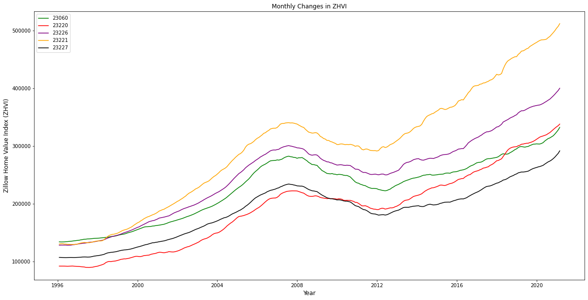
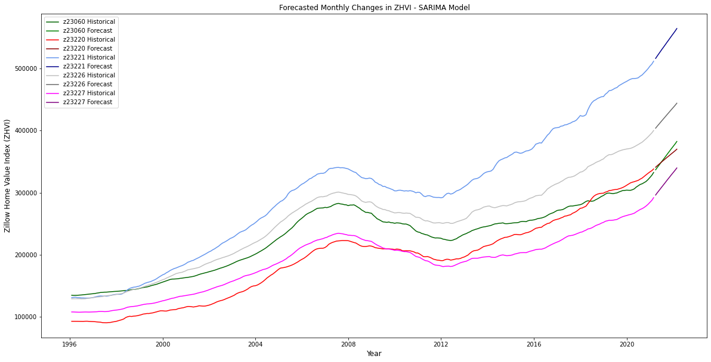
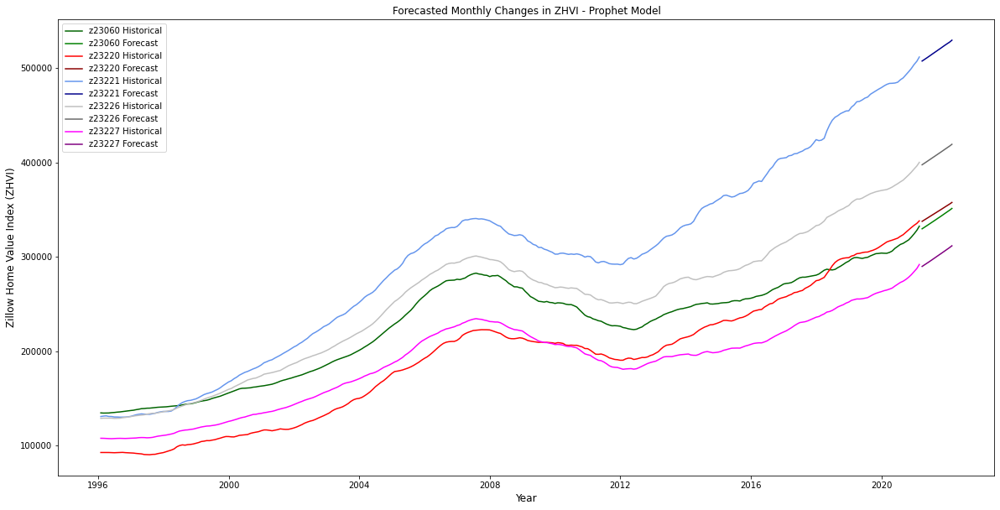
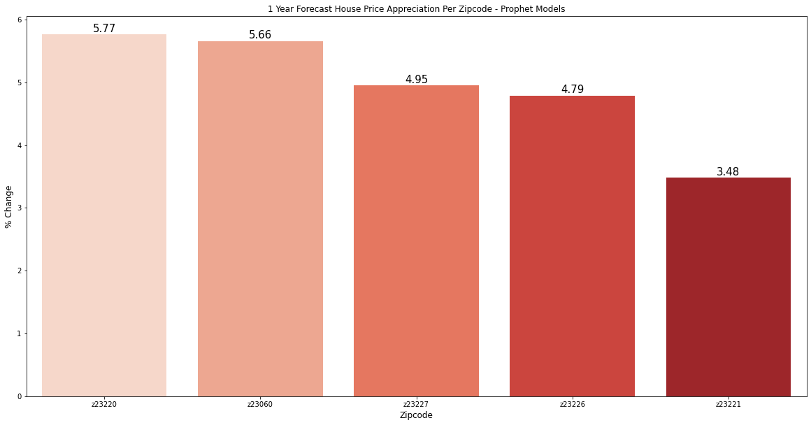
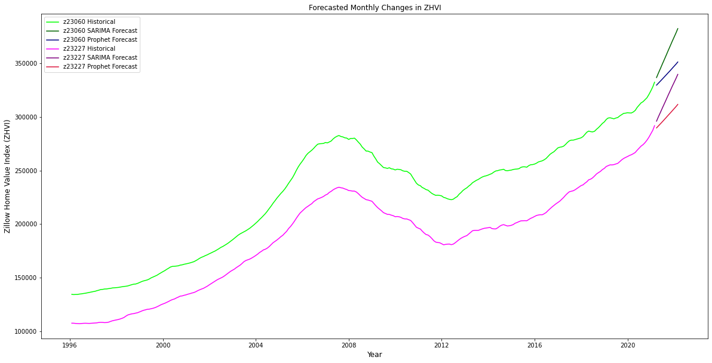
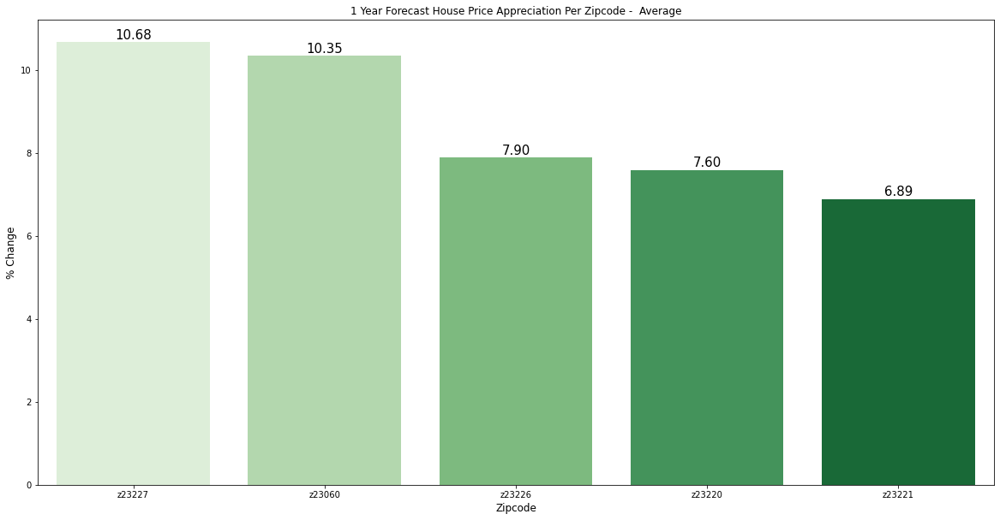

# Richmond Housing Time Series Analysis

## Business Problem
A house flipping company in Richmond has hired me to analyze house price appreciation in various zipcodes. It takes them approximtely 1 year to buy, renovate and begin selling a home. Due to their limited resources, they want to target areas where house prices will have the greatest price appreciation in one year. My goal is to find the best area for them to invest. 

## Process
- Build SARIMA model per ZIP code
- Find the best parameters
- Build Facebook Prophet model per ZIP code
- Use both models to make  one year forecasts
- Calculate one year price appreciation
- Take average results of both models
- Make a determination of the best ZIP code for investments

## Locations
The ZIP codes that were requested are as follows:
23060(A) contains of the towns of Glen Allen and Innsbrook, suburbs of Richmond
23226(B) contains the West End of the city
23221(C) contains Carrytown, the Museum District, and Windsor Farms, thriving cultural areas of the city and adjacent suburbs.
23220(D) contains the Fan District a central urban neighborhood where VCU is located, and surrounding areas.
23227(E) contains the neighborhood of Bellevue, a picturesque area just outside the city and the town of Chamberlayne.

## Data
The original data is gathered from Zillow. The dataframe contains the ZHVI for single family homes from every zipcode in the US from 1/31/1996 to 2/28/2021 on a monthly interval. The Zillow Home Value Index (ZHVI) is a smoothed, seasonally adjusted measure of the typical home value and market changes across a given region and housing type. It reflects the typical value for homes in the 35th to 65th percentile range.

## SARIMA Modeling
- Each ZIP analyzed individually
- Exogenous variable, financial crisis flag, added to capture trend during period of Great Recession
- Second differencing required to achieve stationarity
- PACF plot showed potential for 3 AR terms and a  12 month seasonal term
- ACF plot showed potential for 3 MA terms and a  12 month seasonal term
- Used mix of minimizing AIC and minimizing 12 Month Stepwise Test RMSE to determine final parameters
- Final Parameters for each ZIP code:
  order= (0,2,3)
  seasonal order = (0,0,1,12)
  
## SARIMA Results
Looking purely at the SARIMA model results, zipcode 23227 has the highest forecast return at 16.4% follow by 23060 at 15%. It seems the model may be more influenced by the more recent pricing trends where house prices in the past few months have increased more dramatically then historically due to COVID and very low interest rates.

## Facebook Prophet Results
The Facebook Prophet models forecast 23220 with the highest return of 5.77% but 23060 is very close behind with 5.67. 23227 which did best in the SARIMA modeling is 3rd with 4.95. It seems the Prophet model smoothed the forecast trend over the entire time dataset relative to the SARIMA model.

### Comparison

In general the Prophet model predicted much lower price appreciation than the SARIMA model. It seems the SARIMA model took the most recent trend and expanded on it while the Prophet model smoothed the trend more over the entire time dataset. The large difference further justify taking the average of the two. The below chart shows the difference in the SARIMA model vs the Prophet model for 23060 and 23227

## Final Results

## Conclusion
My final recommendation is that the company should invest in houses in zipcode 23227, which contains the neighborhood of Bellevue, a picturesque area just outside the city and the town of Chamberlayne. My models forecast a one year price appreciation of 10.7%. The SARIMAX model was more accurate on the test data for zipcode 23227 relative to zipcode 23060 as well, lending further credence that 23227 is the strongest zipcode. Zipcode 23060 was a clost second place and is another good option relative to the other three zipcodes with a forecasted appreciation of 10.4%.

Annecdotally these two zipcodes are the most suburban zipcodes of the five, recent real estate trends due to COVID and low interest rates show greater price appreciation in houses for suburban areas.

## Next Steps
Going further with more time and resources, I would like to take the following additional steps in order to improve the project:

-Add more ZIP codes to the analysis. 
-Do more model tuning with Facebook Prophet. 
-Do stepwise testing forecasting, testing and model evaluation with Facebook Prophet. 
-Interview real estate agents about the market trends to get qualitative analysis. 

